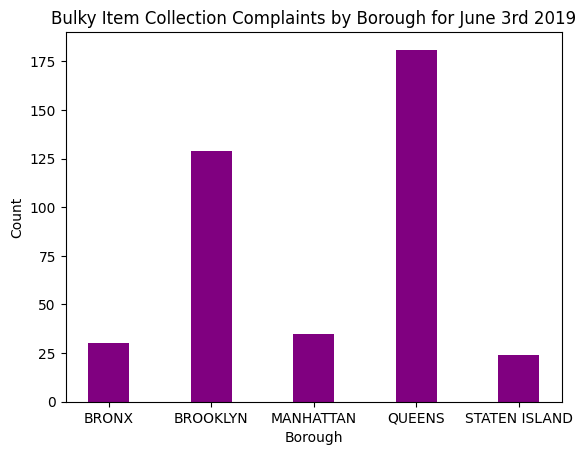

Tess Gompper #260947251

### Get matplotlib:

`pip install matplotlib`

### Prepare Data:

`python borough_complaints.py -i nyc_311_limit_header.csv -s 06/03/2019 -e 06/03/2019 -o june_aug_2019.csv`

### Find most common complaint type:

`csvsql --query "select complaintType, SUM(count) as count from june_3_2019 group by complaintType order by sum(count) desc" june_3_2019.csv > by_complaintType.csv`

`csvsql --query "select complaintType, borough, count from june_3_2019 where complaintType='Request Large Bulky Item Collection'" june_3_2019.csv > bulkyItems.csv`

### Start jupyter

`jupyter notebook`

### In jupyter notebook `complaint_type_analysis.ipynb`:

`import pandas as pd`
`from matplotlib import pyplot as plt`

`df = pd.read_csv('bulkyItems.csv')`

`x = df["borough"].values.tolist()`
`y = df["count"].values.tolist()`

`plt.bar(x, y, color ='purple', width = 0.4)`
`plt.title("Bulky Item Collection Complaints by Borough from June-August 2019")`
`plt.xlabel("Borough")`
`plt.ylabel("Count")`

`plt.show()`

### Result:
##### 'Request Large Bulky Item Collection' was the most common complaint
